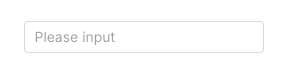
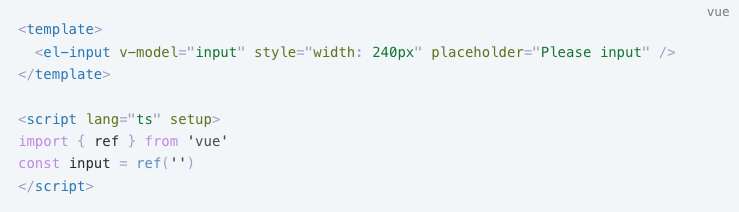
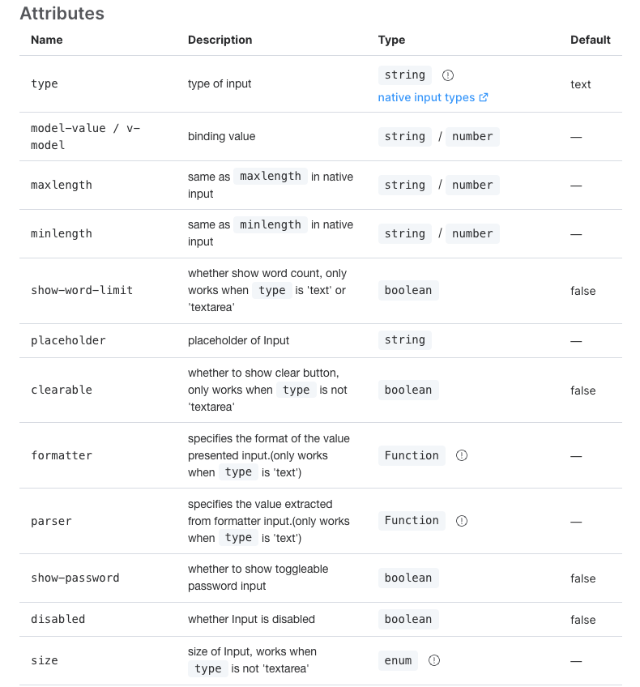
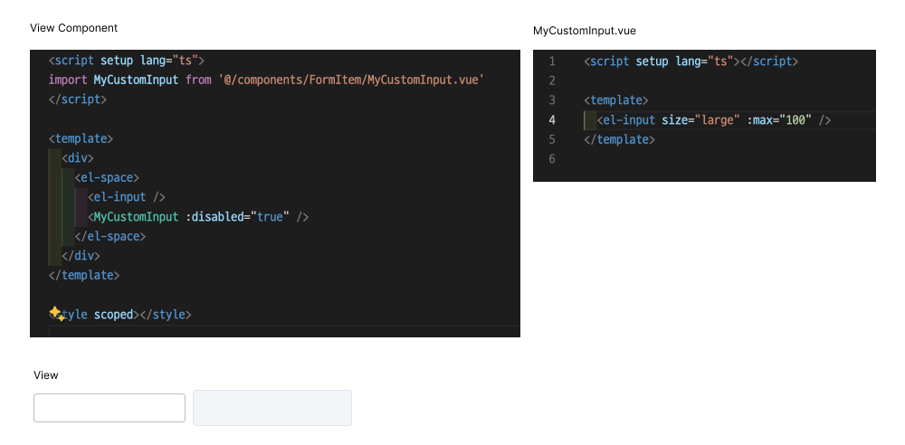

Vue 와 React 를 번갈아 가면서 작업하다 UI 라이브러리를 사용하면서 Props 에 대해서 의문점이 생겼다

만약 UI 라이브러리에서 제공하는 컴포넌트를 커스텀하여서 새로운 컴포넌트를 만들었을때
기존 라이브러리에서 제공하는 컴포넌트의 Props 옵션들을 다시 재선언 하여서 넘겨주어야 하는것인가?




위 컴포넌트는 [Element UI](https://element-plus.org/en-US/component/input.html) 라이브러리에서 제공하는 Input 컴포넌트인데,



보다시피 제공하는 속성이 상당히 많은데 이 모든 속성들을 지정하기에는 굉장히 불편하다.



이처럼 선언적으로 Prop 을 선언하지않아도 최상위 노드에 자동으로 적용된다.

React 에서는 Prop 으로 넘긴 속성을 명시적으로 지정해주지 않는다면 적용이 되지않지만
Vue에서는 자동으로 Prop 으로 넘긴 속성이 부여된다.

Vue 에서는 이것을 폴스루 속성 이라 지칭하며 사용되고 있다.

물론 이 옵션을 비활성화 하여 사용할수도 있다.

```js
<script setup>
defineOptions({
  inheritAttrs: false,
});
// ...setup 로직
</script>
```

폴스루 에 대한 더 자세한 api, 설명은 [공식문서](https://ko.vuejs.org/guide/components/attrs#fallthrough-attributes) 에서 찾아볼수있다.
