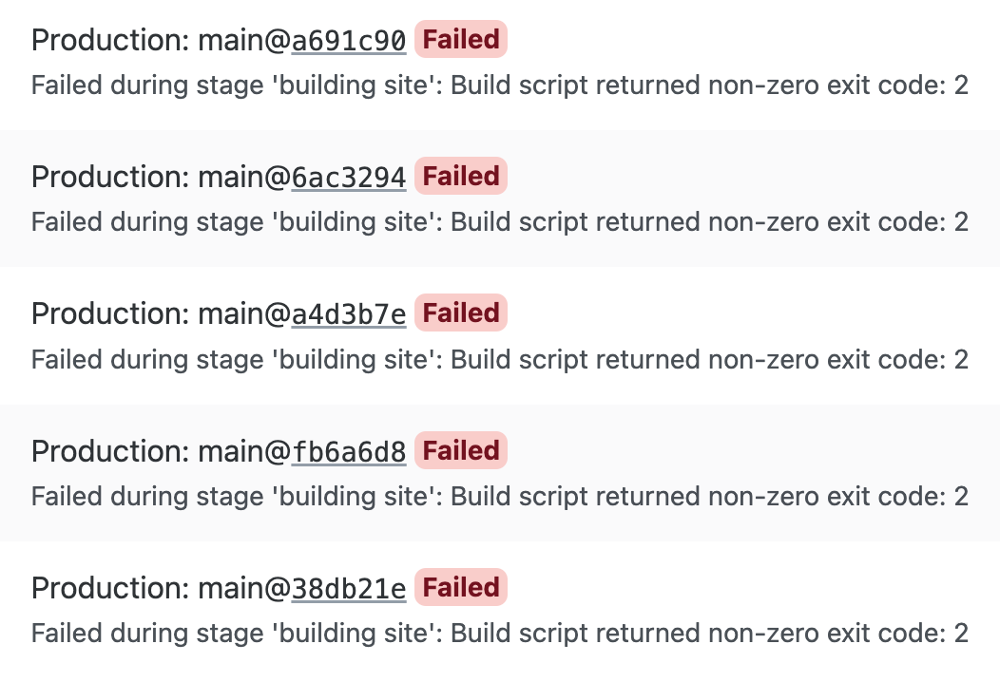
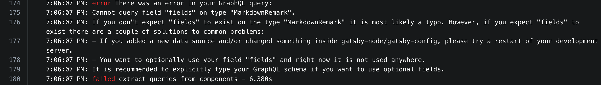
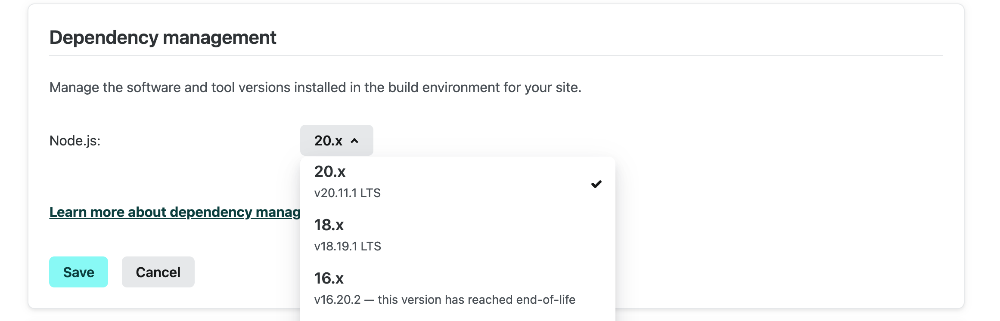

블로그를 개발하면서 netlify 의 웹 호스팅 서비스를 사용하게 되었다.

netlify 를 사용하게 된 이유는

- 무료
- gatsby 팀 에서 권장
- 캐싱, 자동화
- 어플리케이션 log, CI/CD 등 어드민 콘솔 제공

처럼 자동화 된것과 시각적으로 보여주는 콘솔 제공이 가장좋았다.

그래서 처음 기본 세팅을 제외하고 바로 호스팅을 연결한후 배포를 진행했고  
성공적으로 완료되어서 그 이후로는 잘 되고 있겠거니 하고 안보고 있었는데..

점검차 서비스 중인 주소로 접속해서 봤는데 수정사항이 적용되지 않고 있어서 바로 build 성공 여부를 확인 해봤더니

계속 실패하고 있었다.

물론 빌드 배포후 점검은 필수이지만 개인 프로젝트이고 로컬에서 문제 없이 빌드 되어서 괜찮다고 생각했는데
아니었다.

원인을 해결하기 위해서 쌓이고 있던 log를 확인후 분석해보았다.

문제는 원래는 폴더 기반의 라우팅 api 를 사용하고 있었다가  
템플릿 생성 기반의 형식으로 전환 하는 과정에서 생긴것 같았다.

에러 내용은  
템플릿 컴포넌트 안에서 실행되는 Graphql query 문에서 동적으로 생성되었던 `fields` 가 존재하지 않는다고 알려준다.

그래서 query 문과 gatsby-node.ts 에서 필드를 생성하는 로직 검수 했지만 문제가 없어보였고,
로컬 에서 빌드시 성공한다는 점으로 보아 **빌드 환경** 문제라고 생각했다.

회사에서도 항상 같은 프로젝트에서 설정 문제가 발생했었을때 Node.js 버전 문제가 가장 빈번하게 일어났었기에
버전 변경후 재시도 하였다.

로컬에서는 v20.11.1(LTS) 버전을 사용중이었고

클라우드 환경에서는 v18 를 사용중 이었다.  
그래서 콘솔창에서 같은 버전인 v20 으로 변경후 retry 해서 성공하였다.

사실 재시도 하여 빌드확인해서 해결 여부를 확인하는것 보다는  
로컬에서 먼저 버전변경 이후 빌드 테스트를 해보는것이 조금더 바람직한것 같다.

시스템 환경 문제 였다는것을 알아냈지만 18 버전과 20 버전에서 어떤 차이점 때문에 문제가 저러한 에러가 발생했는지 알고싶다.
